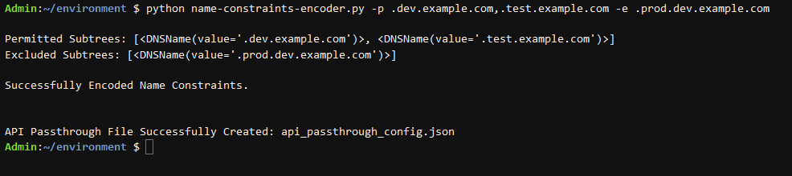
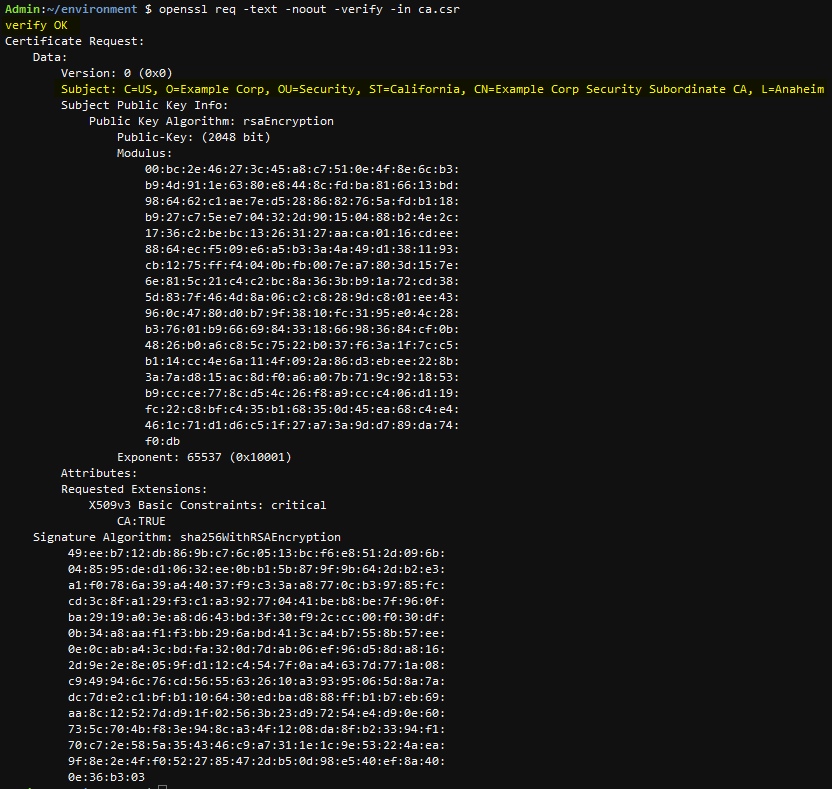
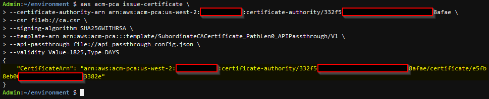
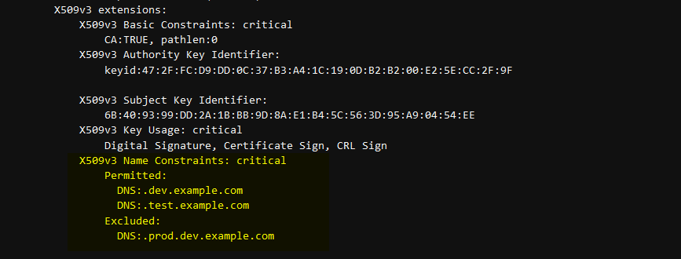
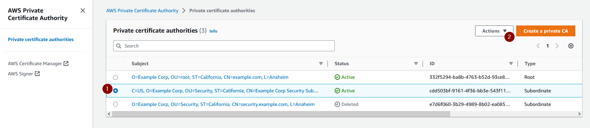
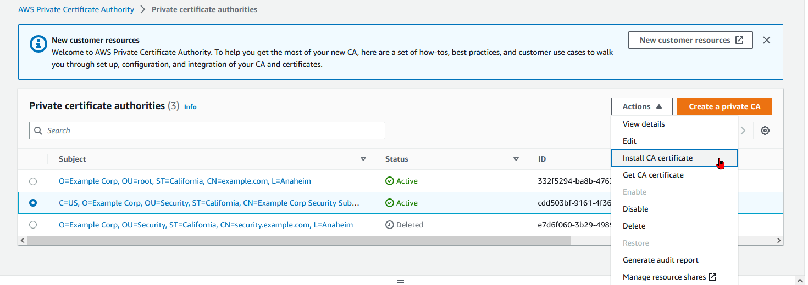
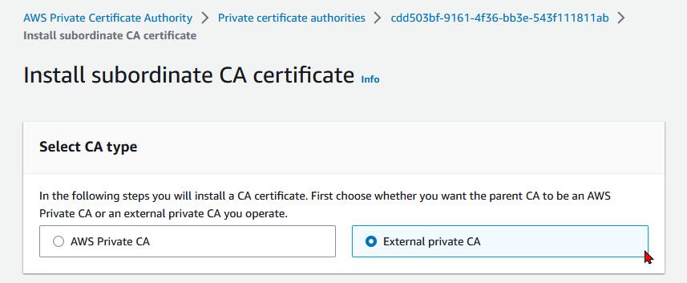
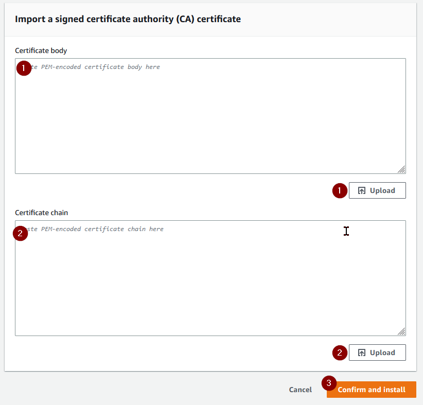
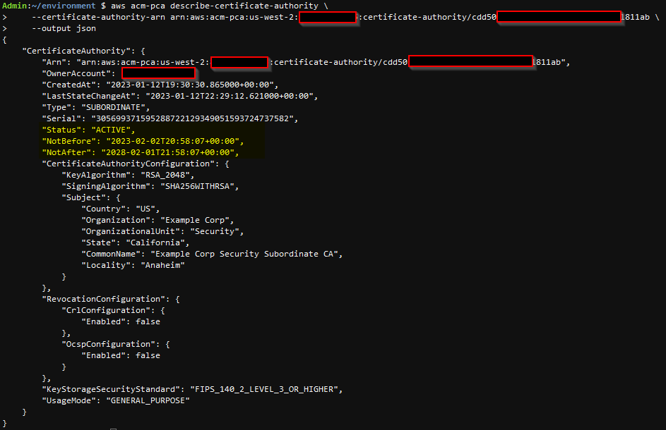
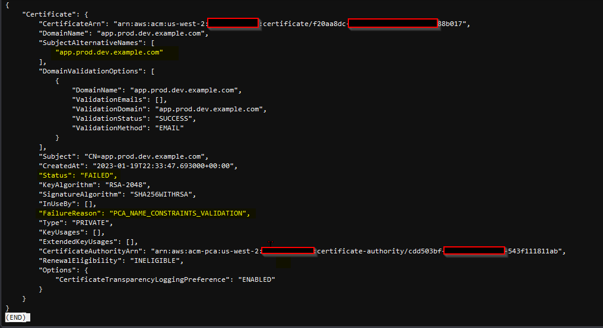

# AWS-Private-CA-Name-Constraints

AWS Private CA now [supports](https://aws.amazon.com/about-aws/whats-new/2022/03/acm-private-ca-custom-names-extensions-constraints/) custom extensions, such as name constraints. Name constraints allow you to permit or deny specific DNS subject names for certificates issued by the Private CA. For example, your development Private CA can be configured to only allow certificates to be issued for *.dev.example.com whereas a separate Private CA for testers will only allow certificates to be issued for *.test.example.com.

## Pre-Requisites

1. Python 3.7.15 or later version installed on your local machine.
2. pip 20.2.2 or later version installed on your local machine.
3. ACM Private CA root CA deployed
4. ACM Private CA subordinate CA deployed
5. IAM permissions to issue, download, and install CA certificates.
6. [AWS Command Line Interface (AWS CLI)](https://aws.amazon.com/cli/) 2.9.13 or later installed.
7. [jq](https://stedolan.github.io/jq/download/) command line tool.

## Solution Overview
1. Encode your custom name constraints and generate an API passthrough file using the Python script.
2. Generate a Certificate Signing Request (CSR) from the Subordinate CA.
3. Use the Root CA to issue a new certificate with the name constraints custom extension.
4. Install the name constraints certificate on the Subordinate CA.
5. Check the status of the Subordinate CA
6. Test Subordinate CA name constraints.

## Encode Custom Name Constraints and Generate API Passthrough File

1. Clone the repository

    ```
    git clone git@ssh.gitlab.aws.dev:raduraul/aws-private-ca-name-constraints.git
    ```

2. Optional: Create a Python virtual environment to run the code for this solution

    Creating a Python virtual environment will allow you to run this solution in a fresh environment without impacting your existing Python packages. The virtual environment has its own independent set of Python packages installed. Read the [official Python documentation](https://docs.python.org/3/library/venv.html) on virtual environments for more information on their purpose and functionality.

   
    * Create a new directory for the Python virtual environment in the users home path.
        ```
        mkdir ~/python-venv-for-aws-private-ca-name-constraints
        ```
    * Create a Python virtual environment using the directory created above.
        ```
        python -m venv ~/python-venv-for-aws-private-ca-name-constraints 
        ```
    * Activate the Python virtual environment.
        ```
        source ~/python-venv-for-aws-private-ca-name-constraints/bin/activate
        ```
    * Upgrade pip to the latest version.
        ```
        python -m pip install --upgrade pip
        ```

3. Navigate to the solution source directory

    ```
    cd <your-path>/aws-private-ca-name-constraints/src/
    ```

4. Install the necessary python packages and dependencies

    Run the command below from the solutions src directory to install the required packages.

    ```
    pip install -r <your-path>/aws-private-ca-name-constraints/src/requirements.txt
    ```

5. Generate the API Passthrough File Using the Python Script

    Run the Python code to generate the encoded value for the name constraints you would like to apply to your subordinate CA. Read the documentation for name constraints in [RFC5280](https://www.rfc-editor.org/rfc/rfc5280) for more information on their functionality. 

    The -p option will allow you to define the permitted subtrees. Separate them using commas if there are multiple. 

    The -e option will allow you to define the excluded subtrees. Separate them using commas if there are multiple. 

    For example:

    ```
    python name-constraints-encoder.py -p .dev.example.com,.test.example.com -e .prod.dev.example.com
    ```

    If the script ran successfully you will see output similar to the screenshot below. 

    


6. Verify the API Passthrough File

    The [api_passthrough_config.json](./src/api_passthrough_config.json) file generated by the Python script should look similar to the example below. 

    Note, the nameConstraints OID is [2.5.29.30](https://oidref.com/2.5.29.30). Reference the [Global OID database](https://oidref.com/).

    The value is generated by the [name-constraints-encoder.py](./src/name-constraints-encoder.py) Python code and is a base64 representation of the encoded ASN.1 name constraints object.

    api_passthrough_config.json content example:
    ```
    {
    "Extensions": {
        "CustomExtensions": [
        {
            "ObjectIdentifier": "2.5.29.30",
            "Value": "MFugPjASghAuZGV2LmV4YW1wbGUuY29tMBOCES5wcm9kLmV4YW1wbGUuY29tMBOCES50ZXN0LmV4YW1wbGUuY29toRkwF4IVLnByb2QuZGV2LmV4YW1wbGUuY29t",
            "Critical": true
        }
        ]
    }
    }
    ```


## Generate a Certificate Signing Request (CSR) from your Subordinate CA

1. Update your AWS CLI to the current version

    Older versions of the AWS CLI will NOT work with the AWS CLI commands listed below and will result in a Parameter validation error as shown below. 
    
    Please [update your AWS CLI to the latest version](https://docs.aws.amazon.com/cli/latest/userguide/getting-started-install.html). 


    Example error output when using an older version of the AWS CLI:
    ```
    Parameter validation failed: Unknown parameter in ApiPassthrough.Extensions: "CustomExtensions", must be one of: CertificatePolicies, ExtendedKeyUsage, KeyUsage, SubjectAlternativeNames
    ```

    Note: The testing below was done using the following version of the AWS CLI: aws-cli/2.9.13 
        

2. Navigate to the directory containing the API Passthrough File

    ```
    cd <your-path>/aws-private-ca-name-constraints/src/
    ```

3. Generate a CSR From your Private CA

    * Obtain the arn from your subordinate CA and paste it into the command below. 
    
    * Update the region to the region where your subordinate CA is deployed.

    ```
    aws acm-pca get-certificate-authority-csr \
    --certificate-authority-arn arn:aws:acm-pca:us-west-2:111111111111:certificate-authority/cdd22222-2222-2f22-bb2e-222f222222ab \
    --output text \
    --region us-west-2 > ca.csr 
    ```

4. Optional: View your Subordinate CA CSR

    ```
    openssl req -text -noout -verify -in ca.csr
    ```
    The screenshot below shows example output. Note that your Subordinate CA's CSR details will be different. 

    

## Use the Root CA to issue a new certificate with the name constraints custom extension 

1. Issue a new certificate from your Root CA

    * Obtain the arn from your __root CA__ and paste it into the command below. 
    * Provide the path to the CSR generated above in the command below.
    * Update the signing-algorithm to your desired algorithm. See the AWS Documentation for [supported algorithms](https://docs.aws.amazon.com/privateca/latest/userguide/supported-algorithms.html).
    * Provide the path to the api_passthrough_config.json generated by the Python script.
    * Update the validity period to your desired validity period. Default below is 1825 days or 5 years.

    ```
    aws acm-pca issue-certificate \
    --certificate-authority-arn arn:aws:acm-pca:us-west-2:111111111111:certificate-authority/111f1111-ba1b-1111-b11d-11ce1a11afae \
    --csr fileb://ca.csr \
    --signing-algorithm SHA256WITHRSA \
    --template-arn arn:aws:acm-pca:::template/SubordinateCACertificate_PathLen0_APIPassthrough/V1 \
    --api-passthrough file://api_passthrough_config.json \
    --validity Value=1825,Type=DAYS
    ```

    * If the command is successful, the output will provide the arn of the certificate issued by the Root CA.
    

    
    * Write down the certificate arn provided by the issue-certificate command above.

        For example:
        ```
        arn:aws:acm-pca:us-west-2:11111111111:certificate-authority/111f1111-ba1b-1111-b11d-11ce1a11afae/certificate/c555ced55c5a55aaa5f555e5555fd5f5
        ```

2. Download the New Certificate With Name Constraints

    * Update the __certificate-authority-arn__ with the arn from your __root CA__ and paste it into the command below. 
    * Update __certificate-arn__ with the arn of the certificate that was issued in the previous step.


    ```
    aws acm-pca get-certificate \
    --certificate-authority-arn arn:aws:acm-pca:us-west-2:111111111111:certificate-authority/111f1111-ba1b-1111-b11d-11ce1a11afae \
    --certificate-arn arn:aws:acm-pca:us-west-2:11111111111:certificate-authority/111f1111-ba1b-1111-b11d-11ce1a11afae/certificate/c555ced55c5a55aaa5f555e5555fd5f5 \
    --output json > cert.json
    ```

3. Separate the Certificate and Certificate Chain into two separate files
    
    * cert.pem for the subordinate CA certificate
    * cert_chain.pem for the root CA certificate chain details

    Run the following commands:

    ```
    cat cert.json | jq -r .Certificate > cert.pem 
    cat cert.json | jq -r .CertificateChain > cert_chain.pem
    ```


4. Verify the new certificate and chain 

    ```
    openssl x509 -in cert.pem -text -noout
    openssl x509 -in cert_chain.pem -text -noout
    ```

    Ensure that the name constraints portion of the certificate is correct. 

    

## Install the Name Constraints Certificate on the Subordinate CA

There are two options for installing the certificate on your Subordinate CA.

### Option 1 (recommended) - Install the certificate via the AWS CLI

Import and install the new certificate with name constraints on your Subordinate CA.

Update the _certificate-authority-arn_ with the arn of your __Subordinate CA__ and run the command below.

```
aws acm-pca import-certificate-authority-certificate \
--certificate-authority-arn arn:aws:acm-pca:us-west-2:111111111111:certificate-authority/111f1111-ba1b-1111-b11d-11ce1a11afae \
--certificate fileb://cert.pem \
--certificate-chain fileb://cert_chain.pem 
```

### Option 2 - Install the certificate via the AWS Console

1. If you are not already on the CA's details page, open the AWS Private CA console at https://console.aws.amazon.com/acm-pca/home

2. Select your Subordinate CA from the _Private certificate authorities_ page. The subordinate CA may have a status of Pending certificate or Active.

    

3. Choose _Install CA Certificate_ from the Actions menu.

    

4. From the _Install subordinate CA certificate page_ select _External Private CA_.

    

5. Scroll down to the _Import a signed certificate authority (CA) certificate_ section.
    * Upload __cert.pem__ using the _Upload_ button or paste the contents of cert.pem into the certificate body input box.
    * Upload __cert_chain.pem__ using the _Upload_ button or paste the contents of cert_chain.pem into the certificate chain input box.
    * Select _Confirm and Install_.

    


## Check the status of the Subordinate CA

Update and run the command below with the _certificate-authority-arn_ for your __Subordinate CA__.

```
aws acm-pca describe-certificate-authority \
--certificate-authority-arn arn:aws:acm-pca:us-west-2:111111111111:certificate-authority/cdd22222-2222-2f22-bb2e-222f222222ab \
--output json
```

Your output should be similar to the screenshot below. Note that the Subordinate CA will now reflect the new validity period from the name constraints certificate in the _NotBefore_ and _NotAfter_ fields.



## Test Subordinate CA Name Constraints

1. Request a new certificate from your Subordinate CA

    Update the command below with your certificate authority arn and the domain name for the requested certificate.

    ```
    aws acm request-certificate --certificate-authority-arn arn:aws:acm-pca:us-west-2:111111111111:certificate-authority/cdd22222-2222-2f22-bb2e-222f222222ab --domain-name app.prod.dev.example.com
    ```

    Take note of the certificate arn output by this command, you will need it in the subsequent step.

2. Describe the new certificate to check its status

    Update and run the command below using the certificate arn from the previous step.

    ```
    aws acm describe-certificate --certificate-arn arn:aws:acm:us-west-2:11111111111:certificate/f11aa1dc-1111-1d1f-1afd-4cb11111b111
    ```

3. Interpreting the describe certificate output

    If the new certificate request fails you will see output similar to the screenshots below. 

    In this case a certificate with a domain name of __app.prod.dev.example.com__ was not permitted because the excluded subtrees doesn't allow certificates for *.prod.dev.example.com to be created.

    


## Related Resources

Global OID Database: https://oidref.com/

Name Constraints OID: https://www.alvestrand.no/objectid/2.5.29.30.html

RFC 5280: https://www.rfc-editor.org/rfc/rfc5280

ASN.1 Encoder/Decoder: https://asn1.io/asn1playground/

Base64 Encoder/Decoder: https://www.base64encode.org/